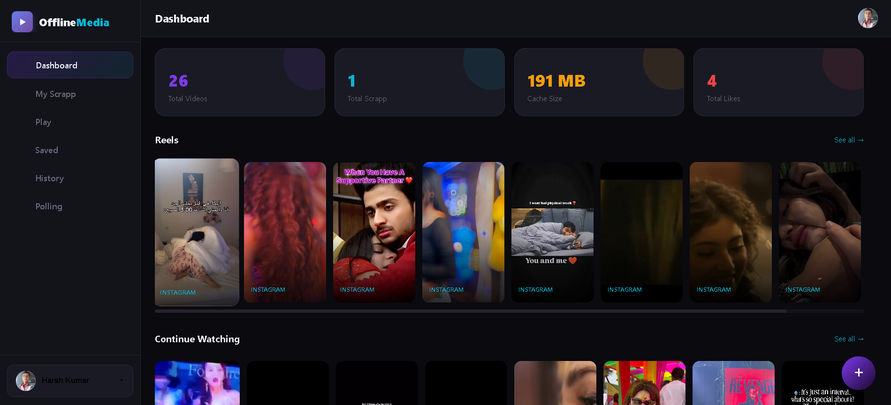
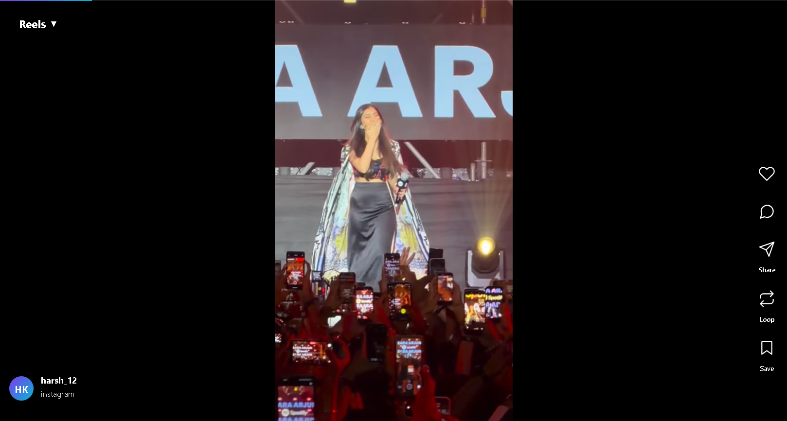
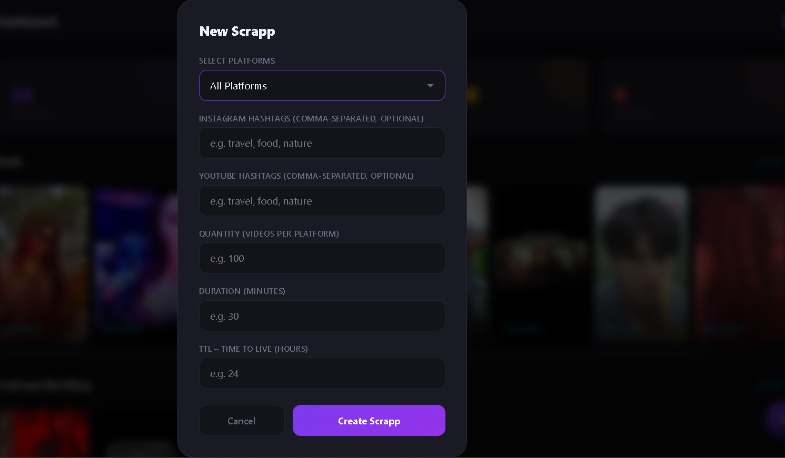
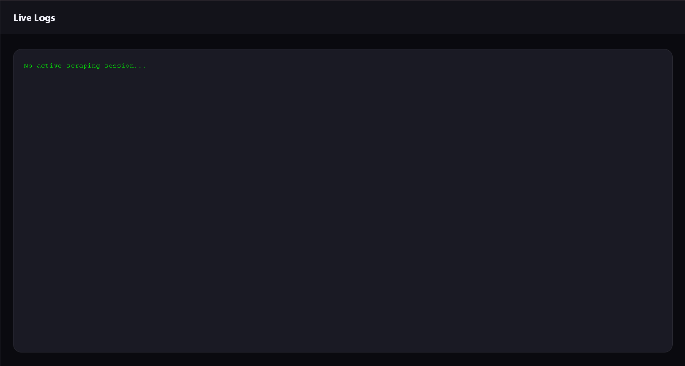
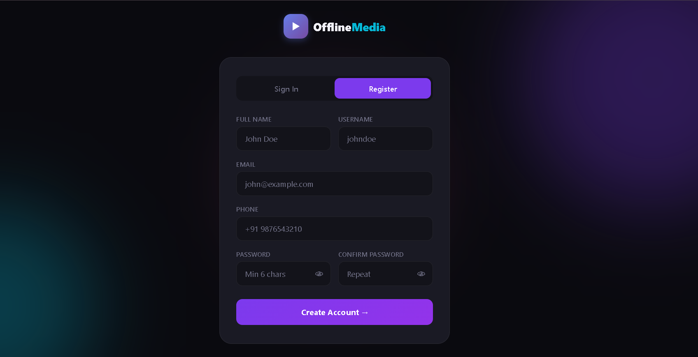
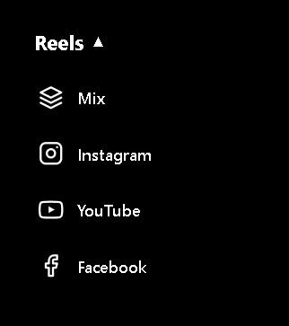

# OfflineMedia

A powerful web application that scrapes short-form videos from Instagram, YouTube, and Facebook, and presents them in a TikTok-style interface with advanced features like watch history, duplicate detection, and smart recommendations.

---

## Table of Contents
- [Problem Statement](#problem-statement)
- [Solution](#solution)
- [Technology Stack](#technology-stack)
- [Features](#features)
- [Desktop Setup](#desktop-setup)

---

## Problem Statement

In today's digital age, users face several challenges with social media content:

1. **Content Overload** - Difficult to find relevant content across multiple platforms
2. **No Offline Access** - Can't watch reels/shorts without internet connection
3. **Scattered Content** - Videos spread across Instagram, YouTube, and Facebook
4. **No Personalization** - Limited control over content curation
5. **Duplicate Content** - Same videos appear multiple times across platforms
6. **No Watch History** - Can't track what you've already watched

---

## Solution

**OfflineMedia** solves these problems by:

- **Automated Scraping** - Fetches videos from multiple platforms based on hashtags
- **Unified Interface** - Instagram style vertical feed for all videos
- **Smart Filtering** - Automatically skips already-watched videos
- **Offline Viewing** - Cache reels/shorts for offline access
- **Watch History** - Permanent tracking of watched content
- **Duplicate Prevention** - Intelligent detection to avoid re-downloading
- **TTL Management** - Automatic cleanup of expired content
- **Social Features** - Like, comment, and save videos

---

## Technology Stack

### **Backend**
- **Python 3.x** - Core programming language
- **Flask** - Web framework
- **SQLAlchemy** - ORM for database operations
- **SQLite** - Database (WAL mode for concurrency)
- **yt-dlp** - Video downloading library
- **Flask-Login** - User authentication

### **Frontend**
- **HTML5** - Structure
- **CSS3** - Styling (Glassmorphism design)
- **JavaScript (Vanilla)** - Interactivity
- **Responsive Design** - Mobile-first approach

### **Scraping**
- **yt-dlp** - Multi-platform video extraction
- **Cookies Authentication** - Instagram login support
- **ThreadPoolExecutor** - Concurrent downloads (10 workers)

### **Database Schema**
- **User** - Authentication & profiles
- **Scrape** - Scraping sessions
- **Video** - Downloaded videos metadata
- **WatchHistory** - Permanent watch tracking
- **Like/Comment** - Social interactions
- **SavedVideo** - Bookmarks

---

## Features

### **Video Management**
- Multi-platform scraping (Instagram, YouTube, Facebook)
- Hashtag-based content discovery
- Automatic duplicate detection
- Watch history filtering
- TTL-based content expiration
- Bulk video downloads

### **User Interface**
- Instagram style vertical feed
- YouTube Shorts-style horizontal rows
- Swipe navigation (up/down)
- Double tap to like
- Long press for 2x speed
- Auto-play previews
- Smooth animations

### **Smart Features**
- Continue watching section
- Unwatched videos prioritized
- Skip already-watched content during scraping
- Sequential preview playback
- Real-time progress tracking

### **Social Features**
- Like videos
- Comment system
- Save/bookmark videos
- Share functionality
- User profiles with avatars

### **Dashboard**
- Statistics (videos, scraps, cache size, likes)
- Recent scraps list
- Multiple reels rows
- Continue watching section
- Profile settings

### **Scraping Control**
- Platform selection (Instagram/YouTube/Facebook/All)
- Custom hashtags per platform
- Duration control (minutes)
- Quantity limits
- TTL configuration (hours)
- Stop/Resume functionality
- Live logs streaming

### **Mobile Optimized**
- Bottom navigation bar
- Touch gestures
- Profile menu with History
- Responsive design
- PWA-ready

### **Security**
- User authentication
- Password hashing (Werkzeug)
- Session management (365 days)
- User-specific content isolation

### Preview
- Dashboard UI

- Reels Player  

- Scraping System

- logs
 
- auth screen

*App support

---

## Desktop Setup

### **Prerequisites**
- Python 3.8 or higher
- pip (Python package manager)
- Git

### **Installation Steps**

1. **Clone the repository**
```bash
git clone <repository-url>
cd "landing page"
```

2. **Install dependencies**
```bash
pip install -r requirements.txt
```

3. **Create cache folder**
```bash
mkdir cache
```

4. **Configure settings** (Optional)
Edit `config.py` to customize:
```python
SERVER_URL = "http://127.0.0.1:5000"
SERVER_PORT = 5000
CACHE_FOLDER = "cache"
THREAD_POOL_WORKERS = 10
```

5. **Setup Instagram cookies** (Optional - for Instagram scraping)
- Login to Instagram in your browser
- Export cookies using a browser extension
- Save as `cookies.txt` in the project root

6. **Run the application**
```bash
python app.py
```

7. **Access the application**
Open your browser and navigate to:
```
http://127.0.0.1:5000
```

### **First Time Setup**

1. **Register an account**
   - Click "Sign Up"
   - Enter username, email, and password
   - Submit

2. **Create your first scrape**
   - Go to Dashboard
   - Click the "+" button
   - Select platforms
   - Enter hashtags (e.g., "funny", "travel")
   - Set duration (minutes) and quantity
   - Set TTL (hours)
   - Click "Create Scrapp"

3. **Watch videos**
   - Go to "Play" section
   - Swipe up/down to navigate
   - Double tap to like
   - Long press for 2x speed
   - Click comment icon to add comments

### **Project Structure**
```
landing page/
├── app.py                 # Main Flask application
├── models.py              # Database models
├── database.py            # Database initialization
├── scraper.py             # Scraping logic
├── agent.py               # Platform-specific scrapers
├── config.py              # Configuration
├── utils.py               # Helper functions
├── requirements.txt       # Python dependencies
├── cookies.txt            # Instagram cookies (optional)
├── cache/                 # Downloaded videos
├── instance/              # SQLite database
└── templates/             # HTML templates
    ├── auth.html          # Login/Register
    ├── dashboard.html     # Dashboard
    ├── play.html          # Video player
    ├── saved.html         # Saved videos
    ├── history.html       # Watch history
    ├── scrapp.html        # Scrape management
    └── polling.html       # Real-time monitoring
```

### **Configuration Options**

**Environment Variables** (Optional):
```bash
export SECRET_KEY="your-secret-key"
export SERVER_PORT=5000
```

**Database:**
- Location: `instance/app.db`
- Type: SQLite with WAL mode
- Backup: Copy `instance/app.db` regularly

**Cache Management:**
- Videos stored in `cache/` folder
- Automatic cleanup based on TTL
- Manual cleanup: Delete files from `cache/`

### **Troubleshooting**

**Issue: Videos not downloading**
- Check internet connection
- Verify cookies.txt for Instagram
- Check logs in scrape details

**Issue: Database locked**
- Close other instances of the app
- Check `instance/app.db-wal` file

**Issue: Port already in use**
- Change `SERVER_PORT` in `config.py`
- Or kill the process using port 5000

### **Performance Tips**

1. **Optimize thread pool**
   - Increase `THREAD_POOL_WORKERS` for faster downloads
   - Decrease for stability on slower systems

2. **Manage storage**
   - Set lower TTL values
   - Regularly clean cache folder
   - Monitor `cache/` folder size

3. **Database maintenance**
   - Vacuum database periodically:
   ```bash
   sqlite3 instance/app.db "VACUUM;"
   ```

---

## Team & Contributions

### **Development Team**

**Harsh Kumar(OM-308) :- Backend Developer & System Architect**
- Designed and implemented core scraping system (`scraper.py`)
- Built platform-specific scrapers for Instagram, YouTube, Facebook (`agent.py`)
- Configured application settings and optimization (`config.py`)
- Developed database schema and migration system (`database.py`)
- Created data models and relationships (`models.py`)
- Implemented utility functions and error handling (`utils.py`)
- Optimized duplicate detection and watch history filtering
- Implemented TTL-based content management
- Built concurrent download system with thread pooling

**Key Contributions:**
- Multi-platform video scraping architecture
- Intelligent duplicate prevention system
- Watch history tracking and filtering
- Database optimization (WAL mode, indexing)
- Error handling and retry mechanisms
- TTL-based automatic cleanup
- Sequential preview playback system

#### Other Devloper team members info. are hidden 
---

## License

This project is for educational purposes only. Respect platform terms of service and copyright laws.

---

## Contributing

Contributions are welcome! Please follow these steps:
1. Fork the repository
2. Create a feature branch
3. Commit your changes
4. Push to the branch
5. Open a Pull Request

---

## Contact

For questions or support, please open an issue on GitHub.

---

**Made with by Amity(Patna) and IIT(Patna) Team**
